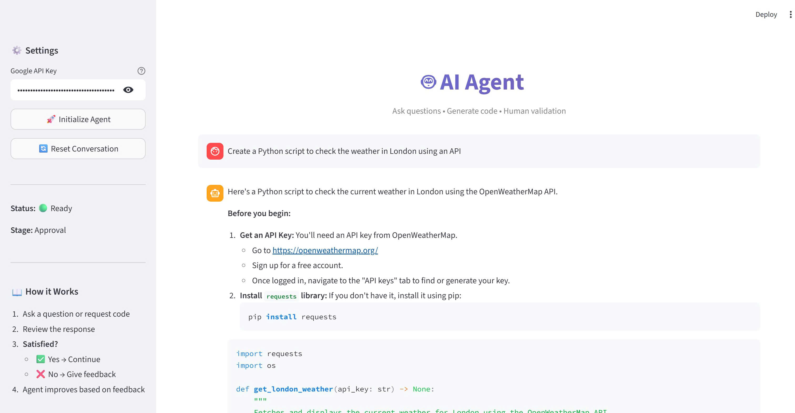
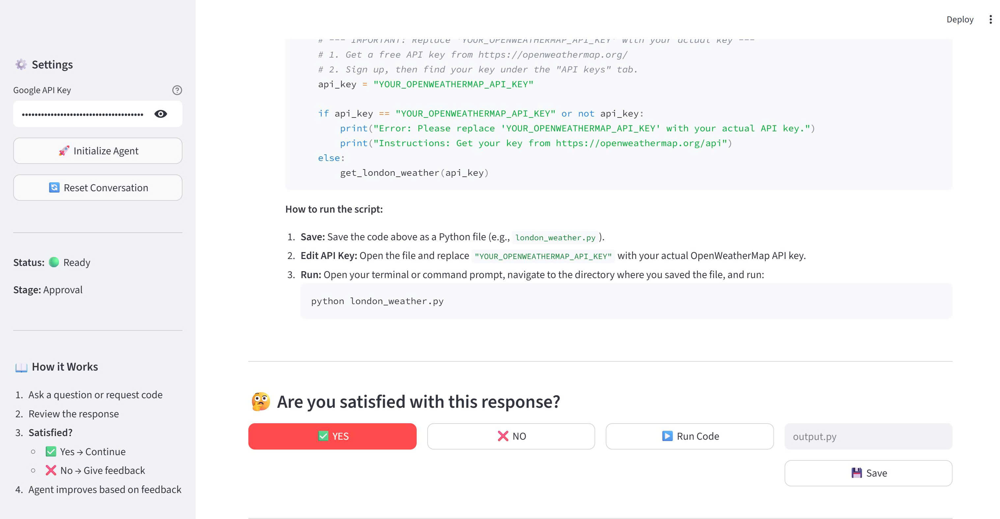

# Human-in-the-Loop AI Agent

Building AI agents is fun, but ensuring quality responses is the real challenge. That's why this agent doesn't just "guess" — it learns from your feedback! 🧠✨



## Key Features

✅ **Satisfaction Loop** - If you're not happy, the agent knows and automatically improves the answer  
✅ **Code Generation & Execution** - Writes, executes, and saves Python code with a single approval  
✅ **Clean UI** - Built with Streamlit for a seamless experience  
✅ **Smart Tech** - Powered by LangChain + Gemini



## How It Works

1. **Ask** - Pose a question or request code generation
2. **Review** - Agent provides a response with code detection
3. **Validate** - You approve or provide feedback
4. **Improve** - Agent automatically revises based on your feedback
5. **Execute** - Run generated code or save it to a file

## Quick Start

1. **Install dependencies:**
   ```bash
   pip install -r requirements.txt
   ```

2. **Set up your API key:**
   Create a `.env` file:
   ```
   GOOGLE_API_KEY=your_api_key_here
   ```

3. **Run the Streamlit app:**
   ```bash
   streamlit run app.py
   ```

4. **Or use CLI mode:**
   ```bash
   python agent.py
   ```

## Workflow

```
User Question → Agent Response → Satisfaction Check
                                      ↓
                              ✅ Approve  |  ❌ Reject + Feedback
                                      ↓              ↓
                              Continue    →  Improved Response
```

## Features in Detail

- **🤖 Intelligent Agent** - Powered by Google Gemini 2.5 Flash
- **💬 Conversation History** - Maintains context across interactions
- **📝 Code Detection** - Automatically identifies and extracts Python code
- **▶️ Code Execution** - Run generated code with one click
- **💾 Code Saving** - Save approved code to files
- **🔄 Feedback Loop** - Continuous improvement based on user input

## Project Structure

```
feedback/
├── agent.py          # Core agent logic with human validation
├── app.py            # Streamlit web interface
├── requirements.txt  # Dependencies
└── public/
    ├── agent.jpg     # Agent interface screenshot
    └── feedback.jpg  # Feedback workflow screenshot
```

## Tech Stack

- **LangChain** - Agent framework and LLM integration
- **Google Gemini** - Language model backend
- **Streamlit** - Web interface
- **Python** - Core language

---

Built with ❤️ to ensure quality AI responses through human feedback

